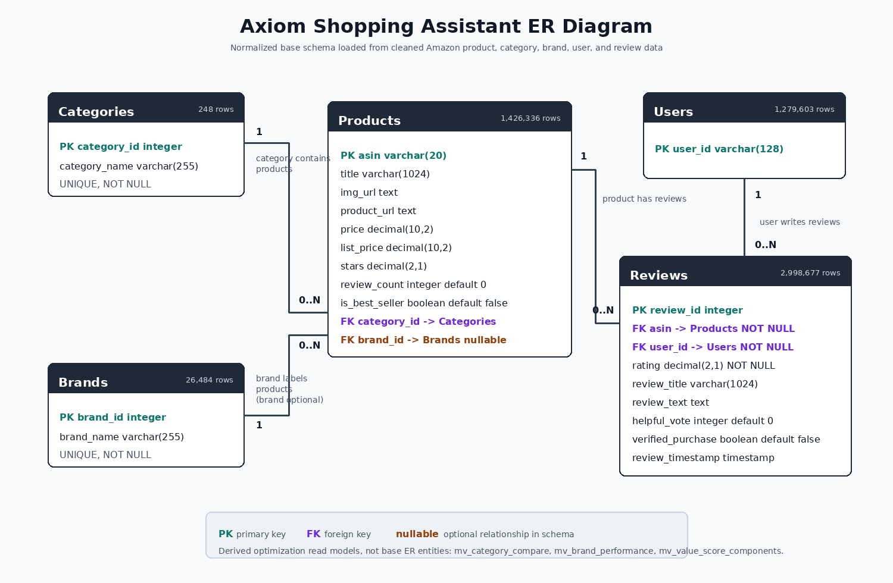

<!-- _class: title-slide -->
<!-- _paginate: false -->

<div class="eyebrow">CIS 5500 · Final Project</div>

# Axiom Shopping Assistant

<div class="tagline">A relational shopping workflow over <strong>1.4 M Amazon products</strong> and <strong>3.0 M linked reviews</strong>, with database-backed search, evidence, savings, analytics, and weighted ranking.</div>

<div class="group">Team 45 · Chenguang Shen · Luis Garcia · Leo Tan · Anika Madan</div>

<div class="meta">Database and Information Systems &nbsp;·&nbsp; University of Pennsylvania &nbsp;·&nbsp; Spring 2026</div>

<!--
SPEAKER NOTES — Title (~20s)
Good [morning/afternoon]. We're Team 45 — Chenguang Shen, Luis Garcia, Leo Tan, and Anika Madan — and our project is **Axiom**, a relational shopping assistant built over 1.4 million Amazon products and roughly 3 million linked reviews. The headline number we'll get to is a twelve-thousand-x speedup on our most-tuned query.
Today's plan: (1) the problem and what we built, (2) the data and schema, (3) the complex queries and their optimizations with real benchmark numbers, then (4) a short live demo on the deployed app.
-->

---

# Problem and goal

Amazon product pages expose **prices, list prices, star ratings, review counts, and seller labels** — but those signals sit side by side, never synthesized. The shopper still has to compare alternatives manually, judge whether a discount is meaningful, and decide which review signals are trustworthy.

<div class="cols">
<div>

### The user problem

The shopper still has to:

- compare alternatives manually,
- judge whether a discount is meaningful,
- decide which review signals are trustworthy.

</div>
<div>

### The project goal

Turn noisy product and review data into a **normalized PostgreSQL database** and a database-backed shopping workflow that answers the questions a shopper actually asks.

| Workflow | Database-backed answer |
|---|---|
| Search & browse | keyword, category, brand, price, rating |
| Product evidence | rating distribution, helpful reviews, alternatives |
| Cart savings | aggregate list vs. current price savings |
| Analytics | category, brand, monthly review trends |
| Value ranking | weighted rating · depth · price · recency |

</div>
</div>

<!--
SPEAKER NOTES — Problem and Goal (~40s)
The user problem is information overload. An Amazon product page already shows the price, the list price, the star rating, the review count, and a seller label — but those signals are presented side by side, never synthesized. The shopper still has to compare alternatives by hand, decide whether a discount is *meaningfully* large, and judge which reviews to trust.
Our goal is to take the raw product and review data and turn it into a normalized PostgreSQL database that *answers* those questions. Concretely, that's five workflows: search and browse, product evidence, cart savings, analytics, and a custom weighted value ranking. Each workflow on this page maps onto one or more SQL queries we'll discuss later.
-->

---

# Application map — eight database-backed pages

<div class="cols-2-3">
<div>

### Stack

**Client.** React + Vite, custom SVG charts, query-mode toggle.

**API.** Express + `pg` pool, validation, TTL cache, optimized vs. original SQL selection.

**Database.** PostgreSQL on AWS RDS — base tables, indexes, materialized views.

**Pipeline.** Python · pandas · psycopg2 — clean, ER, ingest.

</div>
<div>

| Page | Primary routes |
|---|---|
| **Home** | `/products/search`, `/deals`, `/products/trending` |
| **Browse** | `/categories`, `/products/search`, `/products/category` |
| **Deals** | `/deals` (discount sort) |
| **Category / Brand** | `/products/category`, `/products/brand` |
| **Product Detail** | `/products/:asin` + rating-distribution / helpful-reviews / alternatives |
| **Cart** | `POST /cart/savings` |
| **Analytics** | `/analytics/categories/compare` · `/brands/performance` · `/reviews/trend` |
| **Value Rankings** | `/products/value-rankings` (4 weight params) |

</div>
</div>

<!--
SPEAKER NOTES — Application Map (~40s)
We have eight distinct pages, each backed by real database queries. The Home page wires together search, deals, and trending picks. Browse, Category, and Brand pages give paginated product lists with URL-backed filters. Product Detail aggregates four separate routes — metadata, the rating distribution chart, the most helpful reviews with reviewer context, and cheaper higher-rated alternatives. Cart sums savings server-side. Analytics has three custom SVG charts driven by three analytics endpoints. And Value Rankings lets the user weight four signals to produce a custom ranking.
The stack on the left is the whole system: React + Vite client, Express API, PostgreSQL on AWS RDS, and a Python data pipeline.
-->

---

# Two large overlapping data sources

<div class="cols">
<div>

**Amazon Products 2023** &nbsp; <span class="muted">— Kaggle, asaniczka</span><br>
ASIN, title, image / product URLs, price, list price, stars, review count, best-seller flag, category ID.

**Amazon Reviews '23** &nbsp; <span class="muted">— McAuley Lab, Pure-IDs 5-Core + comment export</span><br>
Rating, text, helpful votes, verified flag, timestamp, user ID, ASIN, parent ASIN.

**Shared keys.** `asin` · `parent_asin` · `category_id` · `user_id` — the overlap that makes cross-dataset queries possible.

<p class="caption">Both fact tables clear the rubric's 100 k threshold by more than 10×.</p>

</div>
<div>

<div class="chart">
<div class="ctitle">Cleaned relational scale (log₁₀)</div>

<div class="row"><span class="label">Categories</span><div class="bar flat" style="width:14%">248</div></div>
<div class="row"><span class="label">Brands</span><div class="bar flat" style="width:46%">26,484</div></div>
<div class="row"><span class="label">Users</span><div class="bar steel" style="width:84%">1,279,603</div></div>
<div class="row"><span class="label">Products</span><div class="bar steel" style="width:85%">1,426,336</div></div>
<div class="row"><span class="label">Reviews</span><div class="bar steel" style="width:90%">2,998,677</div></div>

<div class="axis"><span></span><div class="ticks"><span>10²</span><span>10³</span><span>10⁴</span><span>10⁵</span><span>10⁶</span><span>10⁷</span></div></div>
</div>

</div>
</div>

<!--
SPEAKER NOTES — Datasets (~45s)
We use two large overlapping sources, plus a small lookup file for category names. The first is the Amazon Products 2023 catalog from Kaggle — about 1.4 million ASINs with title, image, price, list price, stars, review count, best-seller flag, and category. The second is Amazon Reviews '23 from the McAuley Lab — we use the Pure-IDs 5-Core file for dense user-product interactions, plus the comment export for review text and helpful votes.
The two datasets *overlap* through ASIN, parent ASIN, category ID, and user ID. That overlap is the whole point — it's what lets us join across sources to answer questions like "which discounted products also have strong recent review activity?" The bar chart on the right is on a log scale, so you can see all five tables at once: 248 categories at the small end, three million reviews at the large end. Both fact tables clear the rubric's 100k bar by more than 10x.
-->

---

<!-- _class: dense -->

# Cleaning, pre-processing, and entity resolution

| Stage | Decision and evidence |
|---|---|
| **Products** | Deduplicate by ASIN; parse numeric prices and ratings; normalize FK to `Categories`. |
| **Brand entity resolution** | Source has no brand column. Extract canonical brand from title prefix; normalize punctuation and legal suffixes (`Inc.`, `LLC`); drop brands with **< 5 products** to `NULL brand_id`. Result: **26,484 canonical brands**. |
| **Reviews — streamed** | Stream CSV chunks; normalize headers across comment + Pure-IDs sources; require `user_id` and a 1–5 rating. |
| **ASIN linking (ER)** | Accept `asin` or `parent_asin`; **fall back to parent ASIN** when child ASIN is not in the catalog; drop orphan reviews. |
| **Review facts** | Parse text *and* millisecond-epoch timestamps; clamp helpful votes to ≥ 0; deduplicate by `(asin, user_id, review_timestamp)`. |
| **Output** | Normalized CSVs for `Categories`, `Brands`, `Products`, `Users`, `Reviews`, loaded via PostgreSQL `COPY`. |

<p class="caption">Key ER wins: parent-ASIN fallback recovers reviews that would otherwise drop · brand canonicalization collapses thousands of typo variants · review-fact dedup prevents inflated helpful-vote totals.</p>

<!--
SPEAKER NOTES — Cleaning and Entity Resolution (~60s)
The cleaning pipeline runs in Python and does five things worth highlighting.
First, **brand entity resolution** is non-trivial because the source has no brand column. We extract canonical brand names from the title prefix, normalize punctuation and legal suffixes like "Inc." and "LLC", and crucially, drop brands with fewer than five products to NULL — that prevents thousands of one-off pseudo-brands from typos.
Second, **ASIN linking** is the main entity-resolution step: reviews can reference either the child ASIN or the parent ASIN. We accept both, fall back to parent ASIN when the child isn't in the catalog, and drop orphan reviews entirely. That fallback alone recovers reviews that would otherwise be silently lost.
Third, **review fact deduplication** by the tuple (asin, user_id, review_timestamp) prevents inflated helpful-vote totals when the two source files overlap.
Everything is streamed in chunks — we never hold the full multi-million-row review file in memory. Output is normalized CSVs loaded into Postgres via COPY.
-->

---

# Schema design — five normalized base relations

<div class="cols-3-2">
<div>



</div>
<div>

### Base relations

**Categories** &nbsp; <span class="muted">`category_id`, `category_name`</span>

**Brands** &nbsp; <span class="muted">`brand_id`, `brand_name`</span>

**Products** &nbsp; <span class="muted">`asin` + title, URLs, prices, stars, counts, FKs</span>

**Users** &nbsp; <span class="muted">`user_id`</span>

**Reviews** &nbsp; <span class="muted">`review_id` + ASIN/user FKs, rating, text, helpfulness, timestamp</span>

<p class="caption">Materialized views <code>mv_value_score_components</code>, <code>mv_brand_performance</code>, <code>mv_category_compare</code> are derived read models, not replacement base relations.</p>

</div>
</div>

<!--
SPEAKER NOTES — Schema and ER Diagram (~40s)
Five base relations. Categories and Brands are lookup tables. Products has the ASIN as primary key plus foreign keys to category and brand. Users holds reviewer IDs. Reviews is the fact table — it bridges Products and Users with rating, text, helpful votes, verified flag, and timestamp.
On the diagram you can see the cardinalities: each Product belongs to exactly one Category and at most one Brand; each Review references exactly one Product and one User. The interesting joins all happen through this Reviews fact table.
The three materialized views — value-score components, brand performance, category compare — are derived read models the optimized path uses. They are *not* part of the base schema and don't replace any base relation; they're refreshed from the base tables.
-->

---

<!-- _class: dense -->

# 3NF proof — per relation

| Relation | Non-trivial FDs | 3NF justification |
|---|---|---|
| `Categories` | `category_id → category_name` | Determinant is the primary key. |
| `Brands` | `brand_id → brand_name` | Determinant is the PK after canonicalization; `brand_name` unique. |
| `Products` | `asin → title, urls, price, list_price, stars, review_count, best_seller, category_id, brand_id` | `asin` is the PK; category and brand **names** live in lookup tables, so no transitive FD through an FK to a non-key display attribute. |
| `Users` | (no non-key attribute) | Trivially in 3NF. |
| `Reviews` | `review_id → asin, user_id, rating, title, text, helpful_votes, verified, timestamp` | `review_id` is the PK; product / user details remain in their own tables. The fact table stores only the relationship and review-specific attributes. |

> Every non-trivial FD has a superkey on the LHS — the schema is in 3NF.

<!--
SPEAKER NOTES — 3NF Proof (~40s)
Quickly working down the table. Categories and Brands each have a single non-trivial functional dependency from the primary key to the display name — that's trivially 3NF.
Products is the interesting case: ASIN determines all of title, URLs, prices, stars, review count, the best-seller flag, and both foreign keys. Critically, we do *not* store the category name or brand name on Products — those live only in their lookup tables, so there is no transitive dependency from ASIN through a foreign key to a non-key display attribute.
Users has no non-key attribute, so it's trivially 3NF. Reviews has review_id determining everything else; the product and user details stay in their own tables, which means Reviews stores only the relationship and review-specific facts.
Every non-trivial functional dependency has a superkey on the left-hand side — the schema is in 3NF.
-->

---

# Architecture and query-mode contract

<div class="cols">
<div>

```text
   React + Vite SPA
   custom SVG charts
            │
            │  ?optimized=0|1
            ▼
   Express + pg pool
   validate · cache · route contracts
            │
            ▼
   PostgreSQL · AWS RDS
   tables · indexes · materialized views
```

| Layer | Tech |
|---|---|
| Client | React, Vite, React Router, custom SVG charts |
| API | Node.js, Express, `pg` |
| DB | PostgreSQL on AWS RDS |
| Pipeline | Python, pandas, psycopg2 |
| Test/ops | Vitest, Supertest, benchmark scripts |

</div>
<div>

### Query-mode contract

Every route preserves its public API while supporting:

- `?optimized=0` — original SQL path
- `?optimized=1` — indexed, MV-backed, restructured, or cached path

This is what makes the speedups directly measurable end-to-end — same JSON contract, two SQL plans.

</div>
</div>

<!--
SPEAKER NOTES — Architecture and Query-Mode Contract (~40s)
Three-tier architecture: React + Vite SPA on top, Express + pg pool in the middle, PostgreSQL on AWS RDS at the bottom.
The thing I want to call out is the **query-mode contract** on the right. Every route preserves the exact same public API — same path, same parameters, same JSON response shape — but accepts an `?optimized=0` or `?optimized=1` flag. Zero hits the original SQL path; one hits the indexed, materialized-view-backed, restructured, or cached path.
This is the design choice that makes the speedups directly measurable end-to-end. For every benchmark number you'll see in the next few slides, the original and optimized SQL produce the same ranked output — we're not changing semantics, only the plan.
-->

---

<!-- _class: dense -->

# Complex query catalog — eight families

The rubric requires ≥ 4 complex queries drawing on multiple datasets. Axiom ships **eight** families, all touching ≥ 2 base tables.

| # | Query family · route | Joins | Subq / CTE / View | Aggregation | Universal / Existential | Application use |
|---:|---|:---:|:---:|:---:|:---:|---|
| 1 | Brand performance · `/analytics/brands/performance` | ✓ | CTE | ✓ | HAVING | Brand leaderboard |
| 2 | Review trend · `/analytics/reviews/trend` | ✓ | CTE | ✓ | cond. agg. | Monthly credibility gap |
| 3 | Trending products · `/products/trending` | ✓ | CTE | ✓ | window filter | Activity-based picks |
| 4 | Top value · `/products/top-value` | ✓ | corr. subq. | ✓ | **EXISTS** | Above-avg rated, below-avg price |
| 5 | Value rankings · `/products/value-rankings` | ✓ | CTE + MV | ✓ | weighted score | Custom weighted ranking |
| 6 | Helpful reviews · `/products/:asin/helpful-reviews` | ✓ | lateral / CTE | ✓ | top-k | Reviewer-context evidence |
| 7 | Deals · `/deals` | ✓ | expr. sort | — | price/rating | Discount discovery |
| 8 | Category comparison · `/analytics/categories/compare` | ✓ | MV-backed | ✓ | per-category | Analytics chart |

<!--
SPEAKER NOTES — Complex Query Catalog (~45s)
The rubric asks for at least four complex queries drawing on multiple datasets. We ship eight. The columns on this matrix correspond to the rubric's complexity criteria: multiple joins, subqueries or CTEs or views, aggregation, and universal/existential checks.
Every one of these eight queries touches at least two base tables — most touch three or four. Top value uses an actual EXISTS clause for the recent-review check. Helpful reviews uses a top-k restriction with a lateral aggregation. Value rankings stacks multiple CTEs over a materialized view. Brand performance and review trend use HAVING-style filters and conditional aggregation.
We'll go deep on four of these — top value, value rankings, helpful reviews, and category compare — in the deep-dive slides after the timing table.
-->

---

<!-- _class: dense -->

# Pre / post optimization timings — all routes

<p class="caption">Median ms across 5 measured <code>EXPLAIN ANALYZE</code> runs after 1 discarded warmup. Inputs are representative of real UI usage. Source: <code>docs/timings.md</code>.</p>

| Endpoint | Input | Pre ms | Post ms | Speedup |
|---|---|---:|---:|---:|
| `GET /categories` | none | 0.4 | 0.3 | 1.00× |
| `GET /brands` | none | 6.0 | 5.9 | 1.00× |
| `GET /products/:asin` | `B0178IC734` | 0.1 | 0.1 | 1.00× |
| `GET /products/search` | `kasa`, `minStars=4` | 1.2 | 1.2 | 1.00× |
| `GET /deals` | `maxPrice=250` | 0.5 | 0.5 | 1.00× |
| `GET /products/:asin/rating-distribution` | `B0178IC734` | 8.0 | 6.7 | 1.19× |
| `GET /products/:asin/helpful-reviews` | `B0178IC734` | **9,118.3** | **7.1** | **1,290.44×** |
| `GET /products/:asin/alternatives` | `B0178IC734` | 5.6 | 0.5 | 11.40× |
| `POST /cart/savings` | 5 ASINs | 0.1 | 0.1 | 1.00× |
| `GET /analytics/categories/compare` | none | **3,113.5** | **0.4** | **7,962.92×** |
| `GET /products/trending` | `Toys & Games` | **1,904.6** | **9.7** | **195.98×** |
| `GET /products/top-value` | `reviewedSince=2018-01-01` | **324,918.8** | **855.3** | **379.87×** |
| `GET /analytics/brands/performance` | none | **2,366.2** | **3.7** | **643.68×** |
| `GET /analytics/reviews/trend` | `Toys & Games` | 4,601.9 | 4,853.4 | 0.95× |
| `GET /products/value-rankings` | `0.4/0.2/0.2/0.2` | **17,047.1** | **1.4** | **12,133.17×** |

<p class="caption">Rubric anchor: two pre-opt runtimes exceed 15 s — top-value (~325 s) and value-rankings (~17 s). All headline optimized runtimes are sub-second.</p>

<!--
SPEAKER NOTES — Pre / Post Timings Table (~60s)
This is the full benchmark table from `docs/timings.md`. Median milliseconds across five EXPLAIN ANALYZE runs, after one discarded warmup. Inputs are representative of typical UI usage.
The two rows that satisfy the rubric's 15-second pre-optimization bar are bolded: **top-value** at 324,918 ms — that's about five and a half minutes for a single query — and **value-rankings** at 17,047 ms, about seventeen seconds. After optimization, top-value drops to 855 ms and value-rankings drops to 1.4 ms.
Other headline numbers: helpful reviews from 9 seconds to 7 ms, that's 1,290x. Categories compare from 3 seconds to under a millisecond, almost 8,000x. Brand performance, 644x.
The rows that didn't move are honest results — primary-key lookups, small lookups, or queries already served by base-schema indexes. We'll explain those a few slides later.
-->

---

# Optimization results — runtime (log ms)

<div class="chart">

<div class="row"><span class="label">Top value<span class="sub">/products/top-value</span></span><div class="bar pre" style="width:92%">324,918.8 ms</div></div>
<div class="row"><span class="label"></span><div class="bar post" style="width:49%">855.3 ms</div></div>

<div class="row"><span class="label">Value rankings<span class="sub">/products/value-rankings</span></span><div class="bar pre" style="width:71%">17,047.1 ms</div></div>
<div class="row"><span class="label"></span><div class="bar post" style="width:3%">1.4 ms</div></div>

<div class="row"><span class="label">Helpful reviews<span class="sub">/:asin/helpful-reviews</span></span><div class="bar pre" style="width:66%">9,118.3 ms</div></div>
<div class="row"><span class="label"></span><div class="bar post" style="width:14%">7.1 ms</div></div>

<div class="row"><span class="label">Reviews trend<span class="sub">/analytics/reviews/trend</span></span><div class="bar bad" style="width:61%">4,601.9 ms</div></div>
<div class="row"><span class="label"></span><div class="bar bad" style="width:62%">4,853.4 ms · cache helps repeats</div></div>

<div class="row"><span class="label">Categories compare<span class="sub">/analytics/categories/compare</span></span><div class="bar pre" style="width:58%">3,113.5 ms</div></div>
<div class="row"><span class="label"></span><div class="bar post" style="width:1%">0.4 ms</div></div>

<div class="row"><span class="label">Brand performance<span class="sub">/analytics/brands/performance</span></span><div class="bar pre" style="width:56%">2,366.2 ms</div></div>
<div class="row"><span class="label"></span><div class="bar post" style="width:9%">3.7 ms</div></div>

<div class="row"><span class="label">Trending<span class="sub">/products/trending</span></span><div class="bar pre" style="width:55%">1,904.6 ms</div></div>
<div class="row"><span class="label"></span><div class="bar post" style="width:16%">9.7 ms</div></div>

<div class="axis"><span></span><div class="ticks"><span>1 ms</span><span>10 ms</span><span>100 ms</span><span>1 s</span><span>10 s</span><span>100 s</span><span>1000 s</span></div></div>

<div class="legend">
<span><span class="swatch pre"></span>pre-optimization</span>
<span><span class="swatch post"></span>post-optimization</span>
<span><span class="swatch bad"></span>no SQL gain (cache only)</span>
</div>

</div>

<!--
SPEAKER NOTES — Runtime Chart (~40s)
This is the same data as the table, visualized on a log-millisecond axis. Pre-optimization bars are in terracotta; post-optimization in sage green; the maroon pair is reviews-trend, where the SQL is essentially the same and the route cache is what helps real users.
Notice the visual story: top-value has the longest bar at the top — it crossed the 100-second mark — and the green bar is barely visible because it dropped to under a second. Value rankings, helpful reviews, categories compare, brand performance, and trending all show the same pattern: a long pre-optimization bar collapses to almost nothing.
The post-optimization bar for value rankings is essentially a pixel — that's the 1.4 millisecond result.
-->

---

# Optimization results — speedup (log ×)

<div class="chart">

<div class="row"><span class="label">Value rankings</span><div class="bar steel" style="width:82%">12,133×</div></div>
<div class="row"><span class="label">Categories compare</span><div class="bar steel" style="width:78%">7,963×</div></div>
<div class="row"><span class="label">Helpful reviews</span><div class="bar steel" style="width:62%">1,290×</div></div>
<div class="row"><span class="label">Brand performance</span><div class="bar steel" style="width:56%">644×</div></div>
<div class="row"><span class="label">Top value</span><div class="bar steel" style="width:52%">380×</div></div>
<div class="row"><span class="label">Trending</span><div class="bar steel" style="width:46%">196×</div></div>
<div class="row"><span class="label">Alternatives</span><div class="bar steel" style="width:21%">11.4×</div></div>
<div class="row"><span class="label">Rating distribution</span><div class="bar flat" style="width:3%">1.19×</div></div>
<div class="row"><span class="label">Reviews trend</span><div class="bar flat" style="width:2%">0.95×</div></div>
<div class="row"><span class="label">Deals · search · meta</span><div class="bar flat" style="width:2%">1.00×</div></div>

<div class="axis"><span></span><div class="ticks"><span>1×</span><span>10×</span><span>100×</span><span>1k×</span><span>10k×</span><span>100k×</span></div></div>

<div class="legend">
<span><span class="swatch steel"></span>measured speedup</span>
<span><span class="swatch flat"></span>already index-served (no headroom)</span>
</div>

</div>

<p class="caption">Four routes exceed 500×; both pre-opt runtimes that crossed the 15 s rubric bar finished sub-second after optimization.</p>

<!--
SPEAKER NOTES — Speedup Chart (~30s)
Same routes ranked by speedup factor on a log scale. Four routes exceed 500x. Value rankings tops out at 12,133x; categories compare at almost 8,000x; helpful reviews at 1,290x.
The bottom four bars are intentionally honest. Rating distribution moves a small amount; reviews trend is essentially flat — the SQL is the same and the cache helps repeat reads, not the first measured run; and the rest are already index-served from the base schema.
-->

---

# Optimization techniques — rubric four-up

<div class="steps cols-4">
<div class="step">
<p class="num"><em>01</em></p>
<p class="name">Indexing</p>
<div class="rule"></div>
<p class="body">FK indexes on Products / Reviews; <code>(asin, review_timestamp)</code> composite; <strong>partial index</strong> <code>idx_reviews_verified WHERE verified=TRUE</code>; <strong>partial expression index</strong> <code>idx_products_discount</code> on <code>(1 - price/list_price)</code>; trigram title index; <strong>covering index</strong> on the MV default score.</p>
</div>

<div class="step">
<p class="num"><em>02</em></p>
<p class="name">Materialized views</p>
<div class="rule"></div>
<p class="body"><code>mv_value_score_components</code> (per-product normalized rating · review-count · price-efficiency · recency, plus a precomputed Balanced score), <code>mv_brand_performance</code>, <code>mv_category_compare</code>. Refreshed via <code>scripts/refresh_matviews.js</code>.</p>
</div>

<div class="step">
<p class="num"><em>03</em></p>
<p class="name">Restructuring</p>
<div class="rule"></div>
<p class="body"><strong>Helpful-reviews</strong>: rank top-k <em>before</em> reviewer-stat aggregation. <strong>Browse lists</strong>: page rows <em>before</em> joining display names. <strong>Value rankings</strong>: split Balanced default (indexed) from custom-weight rescore over MV components.</p>
</div>

<div class="step">
<p class="num"><em>04</em></p>
<p class="name">Caching</p>
<div class="rule"></div>
<p class="body">Small in-memory <strong>TTL cache (5 min)</strong> on optimized <code>/categories</code>, <code>/brands</code>, <code>/analytics/categories/compare</code>, and <code>/analytics/reviews/trend</code> (keyed by category). Brand performance is MV-served — no route cache needed.</p>
</div>
</div>

<!--
SPEAKER NOTES — Optimization Techniques (~60s)
The rubric asks us to address four techniques. Here they are, left to right.
**Indexing**: foreign-key indexes on Products and Reviews; a composite (asin, review_timestamp) index that helps helpful-reviews and trending; a partial index on verified-true reviews; a partial *expression* index on the discount expression itself, which is what makes deals fast in the base schema; a trigram index on title for keyword search; and a covering index on the materialized view's default Balanced score.
**Materialized views**: three of them, refreshed via a Node script. The value-score components view is the workhorse — it pre-computes per-category bounds, normalized components, and a default score.
**Restructuring**: three concrete examples — rank-then-aggregate for helpful reviews, page-then-join for browse lists, and a two-path split for value rankings.
**Caching**: a small in-memory five-minute TTL cache on a few routes where repeat reads dominate.
-->

---

# Deep dive · Top value

<div class="cols-3-2">
<div>

### What it does

For each product, return those <strong>cheaper than their category average</strong> and <strong>rated above their category average</strong>, gated by an <strong class="maroon">EXISTS</strong> recent-review check parameterized by <code>reviewedSince</code>.

### Why it was slow

Per-row correlated subqueries computed two category averages and an `EXISTS` over `Reviews` for ≈ 1.4 M products.

### Optimization

Read precomputed per-category bounds and recent-review markers from <code>mv_value_score_components</code>; index the recent-review flag and the <code>reviewedSince</code> join column. The <strong class="maroon">EXISTS</strong> semantics are preserved exactly — moved from query time to MV refresh time.

</div>
<div>

<p class="kicker">Pre-opt &nbsp;→&nbsp; Post-opt</p>

<div class="deepdive">
<span class="pre">324,918.8 ms</span>
<span class="arr">→</span>
<span class="post">855.3 ms</span>
</div>

<div class="deepdive">
<span class="x">380×</span>
<span class="lbl">measured speedup</span>
</div>

<p class="caption">From ~5 minutes per request to under 1 second. Pre-opt timing crosses the rubric's 15-second bar by a factor of ~22.</p>

**Optimization stack.** Materialized view · covering index · query restructure.

</div>
</div>

<!--
SPEAKER NOTES — Top Value Deep Dive (~45s)
Top value asks: for each product, return those that are *cheaper than their category average* and *rated above their category average*, gated by an EXISTS clause requiring a recent review since a user-supplied date.
The original query was correlated. For every one of 1.4 million products, it computed two category averages and ran an EXISTS over the Reviews table. That's why pre-optimization timing is 325 seconds — over five minutes.
The optimization is conceptually simple: read the per-category bounds and the recent-review markers from the materialized view, and index both the recent-review flag and the join column for `reviewedSince`. The EXISTS semantics are preserved exactly — we moved the work from query time to materialized-view refresh time.
End result: 855 milliseconds — a 380x speedup, and well under one second.
-->

---

# Deep dive · Value rankings &nbsp; <span class="maroon">12,133×</span>

<div class="cols-3-2">
<div>

### What it does

Normalizes four signals — <strong>rating strength</strong>, <strong>review depth</strong>, <strong>price efficiency</strong>, <strong>recent activity</strong> — over the catalog and per-category bounds, then ranks products by a user-weighted score.

### Why it was slow

Original query computed global and per-category bounds, normalized four components, joined back to <code>Products</code>, and applied weights — <strong>on every request</strong>.

### Two-path optimization

**1. Balanced preset (`0.4 / 0.2 / 0.2 / 0.2`)** uses the indexed precomputed score `idx_mv_value_components_default_score_cover` — pure index range scan.

**2. Custom weights** rescore *only* the materialized normalized components, skipping the expensive global / per-category aggregation.

</div>
<div>

<p class="kicker">Pre-opt &nbsp;→&nbsp; Post-opt</p>

<div class="deepdive">
<span class="pre">17,047.1 ms</span>
<span class="arr">→</span>
<span class="post">1.4 ms</span>
</div>

<div class="deepdive">
<span class="x">12,133×</span>
<span class="lbl">measured speedup</span>
</div>

<p class="caption">Largest measured speedup in the deck. Pre-opt timing crosses the rubric's 15-second bar; post-opt is in the noise floor.</p>

**Optimization stack.** Materialized view · covering index · two-path split.

</div>
</div>

<!--
SPEAKER NOTES — Value Rankings Deep Dive (~50s)
Value rankings is our most-tuned query — and the largest measured speedup in the deck.
What it does: it normalizes four signals — rating strength, review depth, price efficiency, and recent activity — over the catalog and per-category bounds, then ranks products by a user-weighted score. The user can change the weights with sliders.
Why the original was slow: every request recomputed global *and* per-category bounds, normalized four components, joined back to Products, and applied weights. That's seventeen seconds.
The optimization splits into two paths. **Path one**, the Balanced preset 0.4/0.2/0.2/0.2, hits the indexed precomputed default score on the materialized view — pure index range scan, 1.4 milliseconds. **Path two**, custom weights, only rescores the materialized normalized components, skipping the expensive global and per-category aggregation entirely.
Twelve thousand-x speedup, and post-opt is in the noise floor.
-->

---

# Deep dive · Helpful reviews &nbsp; · &nbsp; Category compare

<div class="cols">
<div>

### Helpful reviews — restructuring

<div class="deepdive">
<span class="pre">9,118.3 ms</span>
<span class="arr">→</span>
<span class="post">7.1 ms</span>
<span class="x">&nbsp;1,290×</span>
</div>

Original computed reviewer-aggregate CTE over **all** reviewers for the product.

Optimized path **ranks the top reviews first**, then computes reviewer stats only for that small set (lateral aggregation). Same ranking output, far less work.

**Stack.** restructure · lateral · top-k first.

</div>
<div>

### Category compare — MV + cache

<div class="deepdive">
<span class="pre">3,113.5 ms</span>
<span class="arr">→</span>
<span class="post">0.4 ms</span>
<span class="x">&nbsp;7,963×</span>
</div>

Live aggregate over `Products × Reviews × Categories` replaced by a read from `mv_category_compare`.

A 5-minute route cache further smooths repeat loads of the analytics page.

**Stack.** materialized view · route cache · refresh-time aggregate.

</div>
</div>

<!--
SPEAKER NOTES — Helpful Reviews and Category Compare (~50s)
Two more deep dives, side by side.
**Helpful Reviews** is a pure restructuring win. The original query computed a reviewer-aggregate CTE over *every* reviewer for the product, then filtered down to the top reviews at the end. The optimized path reverses that order: rank the top-k reviews first, then compute reviewer stats only for that small set with a lateral aggregation. Same output rows, far less work — 9 seconds down to 7 milliseconds.
**Category Compare** is a materialized-view win. The original ran a live aggregate over Products joined to Reviews joined to Categories — about 3 seconds. The optimized path reads from `mv_category_compare`, which precomputes per-category counts, averages, and rating bands at refresh time. A 5-minute route cache further smooths repeat loads of the analytics page. End result: 0.4 milliseconds, almost 8,000x.
-->

---

# Honest results — where optimization is modest

| Route | Result | Why |
|---|---|---|
| `/products/:asin`, `POST /cart/savings`, `/products/search`, `/categories`, `/brands`, `/deals` | ≈ 1.00× | Already PK lookups, small lookups, or served by a base-schema index (`idx_products_discount`). No more wins on the hot path. |
| `/products/:asin/rating-distribution` | 1.19× | Already small per-ASIN aggregate. We did not over-engineer it. |
| `/analytics/reviews/trend` | <span class="maroon"><strong>0.95×</strong></span> | Same grouped SQL; planner already chose well for the representative input. The 5-min **route cache** is what helps real users on repeat reads, not the first measured run. |

> We chose not to contrive optimizations on already-cheap queries. Restructuring only happened where `EXPLAIN ANALYZE` showed the planner doing real work — and we report median first-run timings, not cache-warmed numbers.

<!--
SPEAKER NOTES — Honest Results (~40s)
We want to be transparent about the routes that didn't move.
The first row — product detail, cart savings, search, categories, brands, deals — those are all already index-served by base-schema indexes, or they're primary-key lookups, or they're small lookup tables. There's no headroom; we're at sub-millisecond already.
Rating distribution is a small per-ASIN aggregate; we deliberately didn't over-engineer it.
Reviews trend is the most interesting honest case. The post-optimization median is *slightly slower* than the pre — 0.95x. The SQL is the same; the planner already chose well for our representative input. What helps real users is the five-minute route cache, but the benchmark records the *first* EXPLAIN ANALYZE run, so the cache benefit doesn't show up in the table.
We chose not to contrive optimizations on already-cheap queries — and we report median first-run numbers, not cache-warmed.
-->

---

# Robustness · testing · look & feel

<div class="cols">
<div>

### Input sanity

ASIN regex, required keyword/category/ASIN params, numeric and date range checks, zero-sum weight rejection, max 200 ASINs in cart.

### SQL safety

Parameterized `pg` bindings throughout — no string concatenation anywhere.

### UI robustness

Loading / empty / error states on every API-backed page; **abortable fetches** prevent stale renders after filter changes.

</div>
<div>

### API tests

Route, query-mode-selection, cache, validation, and response-shape tests under `server/tests/`.

### Client tests

API path building, routing, cart behavior, pages, charts, formatting helpers, query-mode toggle.

### Look & feel

Custom SVG bar / horizontal-bar / line charts; layout deliberately distinct from the HW2 starter UI; consistent rating, price, timestamp formatters.

</div>
</div>

<!--
SPEAKER NOTES — Robustness, Testing, Look and Feel (~45s)
This slide covers the rubric's robustness and look-and-feel categories.
On input sanity: every route validates — ASIN regex, required parameters, numeric and date range checks, zero-sum weight rejection on value rankings, a 200-ASIN cap on the cart endpoint.
SQL safety: every query uses parameterized `pg` bindings; there's no string concatenation anywhere in the SQL layer.
Tests: we have route, query-mode-selection, cache, and validation tests on the server, and on the client we cover the API path builder, routing, cart behavior, charts, and the query-mode toggle.
UI robustness: every API-backed page has loading, empty, and error states, and we use abortable fetches so stale results never overwrite a newer filter change.
Look and feel: charts are custom SVG, and the layout is intentionally distinct from the HW2 starter.
-->

---

# Technical challenges and resolutions

| Challenge | Resolution |
|---|---|
| **Product / review entity alignment** — child vs. parent ASIN, orphan reviews. | Cleaner accepts both ASIN columns, **falls back to parent ASIN** when the child is missing from the catalog, drops orphans before ingestion. |
| **Brand entity resolution** — no brand column; noisy titles. | Conservative title-prefix extraction, punctuation / legal-suffix normalization, canonical display names, **5-product threshold** to avoid one-off entities. |
| **Multi-million-row review files.** | Streaming chunked CSV processing, incremental review CSV writes, in-memory user / duplicate tracking, stable FK relationships preserved end-to-end. |
| **Optimization tradeoffs.** | Some rewritten SQL was *slower* than the planner's choice. We kept original variants for comparison, used MVs only for stable aggregates, and route-cached only repeat-heavy endpoints. |
| **Source asymmetry.** | Documented that the checked-in `amazon_reviews.csv` is a smaller subset than the loaded review corpus; the cleaner discovers additional review streams in `data/raw/`. |

<!--
SPEAKER NOTES — Technical Challenges (~50s)
Five challenges worth calling out.
**Entity alignment** — child versus parent ASIN, plus orphan reviews. Solved by accepting both columns, falling back to parent ASIN, and dropping orphans before ingestion.
**Brand entity resolution** — no brand column in the source. We had to be conservative: title-prefix extraction, punctuation and legal-suffix normalization, canonical names, and a 5-product threshold to avoid one-off pseudo-brands.
**Multi-million-row review files** — too large to fit in memory comfortably. Solved with chunked streaming, incremental writes, and stable foreign-key tracking.
**Optimization tradeoffs** — some of our rewritten SQL was actually *slower* than the planner's original choice. We kept original variants for comparison, used materialized views only for stable aggregates, and route-cached only repeat-heavy endpoints.
**Source asymmetry** — the checked-in review CSV is smaller than what we loaded. We documented this and made the cleaner discover additional streams in `data/raw/`.
-->

---

# Extra credit — deployment

The application is **deployed and reachable by TAs during the live demo.**

<div class="cols">
<div>

### Frontend

`https://cis550-final-project.onrender.com`

React + Vite static build on Render.

### API

`https://team45-cis550-final-project.vercel.app`

Express on Vercel serverless.

### Database

AWS RDS PostgreSQL — schema, indexes, materialized views, cleaned CSVs loaded via the data pipeline.

</div>
<div>

### Cross-service wiring

**Frontend → API.** `VITE_API_BASE_URL = https://team45-cis550-final-project.vercel.app`

**API CORS allowlist.** `CLIENT_ORIGIN = https://cis550-final-project.onrender.com`

### Rubric extra credit claimed

Deployment — TAs can access the live site during the presentation. Local fallback is ready as a backup.

</div>
</div>

<!--
SPEAKER NOTES — Deployment Extra Credit (~30s)
We claim deployment as our extra-credit feature. The frontend is on Render at the URL shown; the API is on Vercel; the database is AWS RDS PostgreSQL with all the indexes and materialized views applied.
Cross-service wiring is the standard pattern: the frontend points at the API via VITE_API_BASE_URL at build time, and the API CORS allowlist is set to the frontend origin.
For the live demo, we'll use the deployed URL. We have a local fallback ready in case of network issues.
-->

---

# Live demo road map

Following `docs/demo_script.md`. Each step calls real routes against the deployed stack with `?optimized=1`.

| # | Segment | Routes / pages | Watch for |
|---:|---|---|---|
| 1 | **Home and search** | `GET /products/search`, query-mode toggle | Keyword search; flip toggle to compare paths. |
| 2 | **Product detail** | `/products/:asin` + rating-distribution + helpful-reviews + alternatives | Helpful reviews **9,118 → 7.1 ms** headline. |
| 3 | **Cart savings** | `POST /cart/savings` | Aggregate list / current / savings; ASIN-array validation. |
| 4 | **Analytics** | category compare, brand performance, review trend | Category compare **3,113 → 0.4 ms**; review trend cache. |
| 5 | **Value rankings** | `/products/value-rankings`, Balanced preset + sliders | Value rankings **17,047 → 1.4 ms** (12,133×). |
| 6 | **Close** | ER diagram + this deck | Final row counts, strongest speedup, deployment URL. |

<!--
SPEAKER NOTES — Live Demo Road Map (~30s)
Now we'll switch to the deployed app for the live demo. The road map: home and search first, then a product detail page with all four detail routes, then the cart, then analytics with three charts, then value rankings with the slider, and we'll close on the deployment URL.
For each step I'll mention the route being called and flip the optimized toggle where it's interesting. We'll spend the most time on value rankings — that's the twelve-thousand-x route.
-->

---

<!-- _class: closing-slide -->
<!-- _paginate: false -->

<div class="eyebrow">Thank you.</div>

# Questions?

<div class="tagline">Axiom Shopping Assistant &nbsp;·&nbsp; CIS 5500 Final Project &nbsp;·&nbsp; Spring 2026</div>

<div class="meta">Team 45 · Chenguang Shen · Luis Garcia · Leo Tan · Anika Madan</div>

<!--
SPEAKER NOTES — Summary (~40s)
To wrap up:
Two large overlapping datasets, integrated through ASIN linking and brand canonicalization. A normalized 3NF schema with five base relations and three materialized views as derived read models. Eight complex query families with full pre/post benchmarks — and two of them clear the rubric's 15-second pre-optimization bar by wide margins.
We covered all four optimization techniques the rubric asks about — indexing including partial expression and covering indexes, materialized views, query restructuring, and TTL caching. And we kept the routes that did *not* benefit in the timing table, with honest reasons.
The app is live on Render plus Vercel plus AWS RDS, and we're happy to take questions.
Thank you.
-->
